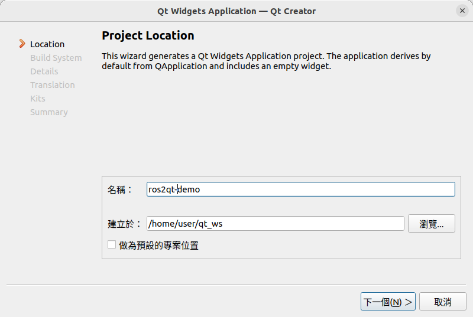
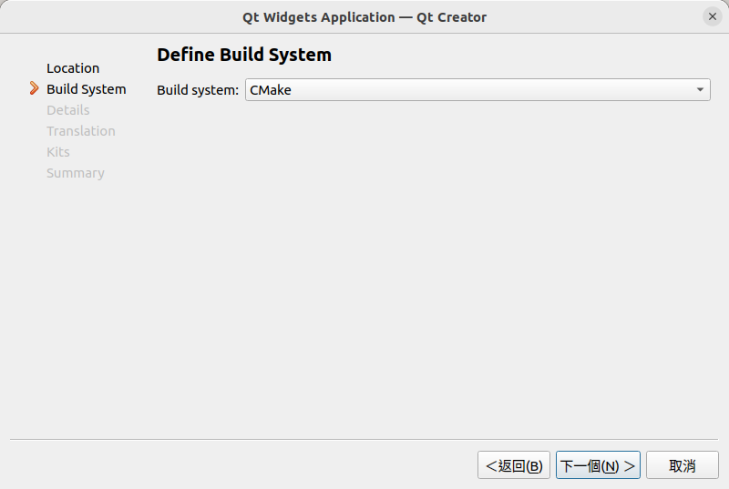
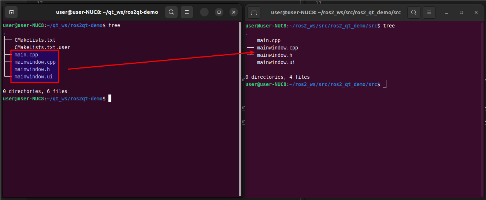

# Readme

package 名稱為 `ros2_qt_demo`


**建立ros包**

```shell
cd ~/ros2_ws/src
ros2 pkg create --build-type ament_cmake ros2_qt_demo
```


**編譯測試**

```shell
cd ~/ros2_ws/
#colcon build
colcon build --packages-select=ros2_qt_demo
```


**用qt建立簡單的ui**



編譯系統記得選cmake




**UI檔案搬移**



