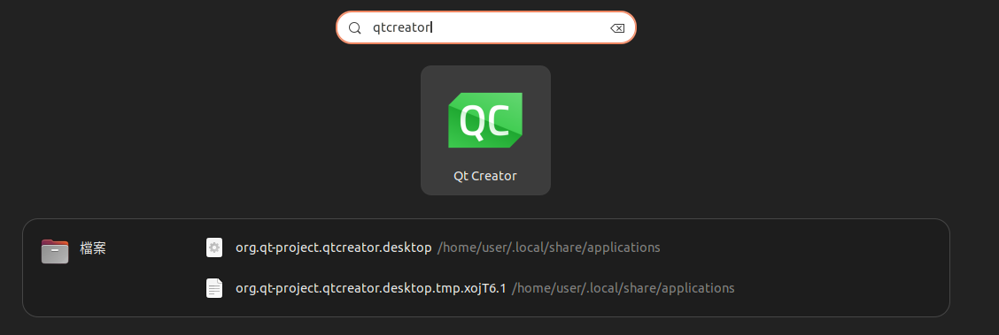
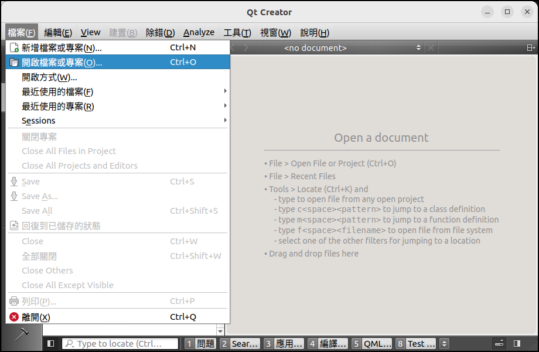
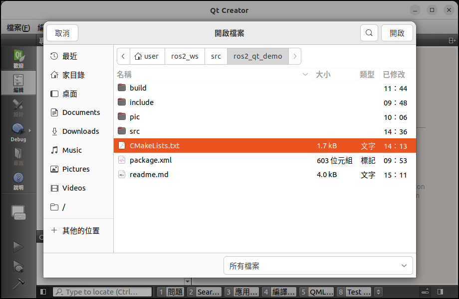
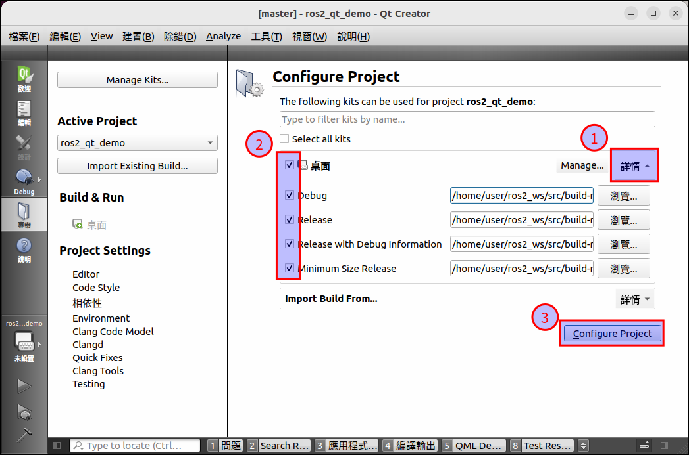
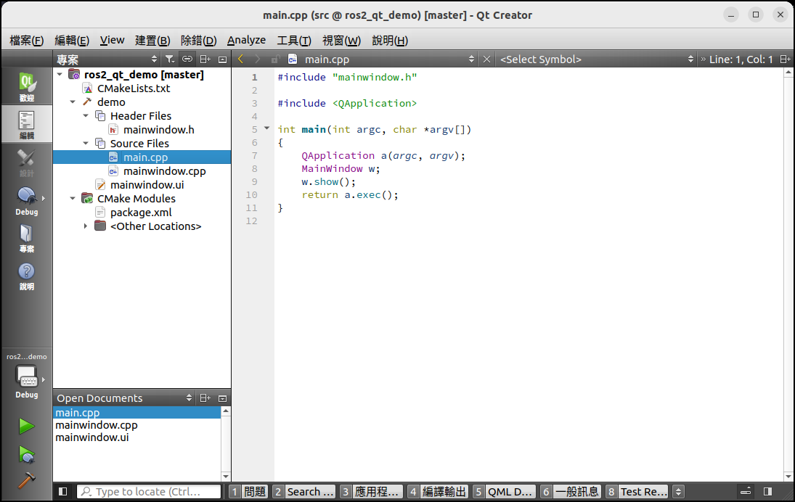

# Readme

在ros2的環境下

建立一個可以被qtcreator編輯

又可以被colcon build編譯的ros package project

以下

package 名稱為 `ros2_qt_demo`

node 名稱為 `demo`


## **建立ros包**

```shell
cd ~/ros2_ws/src
ros2 pkg create --build-type ament_cmake ros2_qt_demo
```


## **用qt建立簡單的ui**


編譯系統記得選cmake


## **UI檔案搬移**


## **調整CMakeLists.txt**


```makefile
cmake_minimum_required(VERSION 3.8)
project(ros2_qt_demo)

# ------------------------------------------
# 使用 C++ 14
# ------------------------------------------
if(NOT CMAKE_CXX_STANDARD)
  set(CMAKE_CXX_STANDARD 14)
endif()

# ------------------------------------------
if(CMAKE_COMPILER_IS_GNUCXX OR CMAKE_CXX_COMPILER_ID MATCHES "Clang")
  add_compile_options(-Wall -Wextra -Wpedantic)
endif()

# ------------------------------------------
# 設定編譯類型和相依套件 
# ------------------------------------------
# ros
find_package(ament_cmake REQUIRED)
find_package(rclcpp REQUIRED)
find_package(std_msgs REQUIRED)
# qt
find_package(Qt5 REQUIRED COMPONENTS Core Gui Widgets)

# ------------------------------------------
# 添加可執行文件 
# ------------------------------------------
add_executable(demo 
  src/main.cpp
  src/mainwindow.cpp
  src/mainwindow.h
  src/mainwindow.ui
)

# ------------------------------------------
# 鏈接依賴項
# ------------------------------------------
# ros
target_link_libraries(demo 
  ${rclcpp_LIBRARIES} 
)
# qt
target_link_libraries(demo 
  Qt5::Core 
  Qt5::Gui
  Qt5::Widgets
)

# ------------------------------------------
# 包含其他包的標頭檔路徑
# ------------------------------------------
ament_target_dependencies(demo 
  rclcpp
  std_msgs
)

# ------------------------------------------
# 設置自動MOC、UIC和RCC (與QT相關)
# ------------------------------------------
set_target_properties(demo PROPERTIES AUTOMOC ON)
set_target_properties(demo PROPERTIES AUTOUIC ON)
set_target_properties(demo PROPERTIES AUTORCC ON)
# ------------------------------------------

# 安装可执行文件
install(TARGETS demo
  DESTINATION lib/${PROJECT_NAME}
)

ament_package()
```


## **編譯測試**

```shell
cd ~/ros2_ws/
#colcon build
colcon build --packages-select=ros2_qt_demo
```


## **執行測試**

```shell
#source ~/ros2_ws/install/setup.bash #如有必要
ros2 run ros2_qt_demo demo
```


## **使用qtcreator開啟ROS的project**

### 啟動qtcreator的方法

**注意啟動qtcreator必須具有ROS的環境才能正常載入ROS的project**

- **方法1** 使用終端機開啟qtcreator

```shell
#source ~/ros2_ws/install/setup.bash #如有必要
qtcreator
```

- **方法2** 透過應用程式欄位啟動qtcreator



啟動前必須要編輯.desktop檔案

```shell
gedit ~/.local/share/applications/org.qt-project.qtcreator.desktop
```

```ini
[Desktop Entry]
Type=Application
Exec=/usr/bin/qtcreator
Name=Qt Creator
GenericName=The IDE of choice for Qt development.
Icon=QtProject-qtcreator
StartupWMClass=qtcreator
Terminal=false
Categories=Development;IDE;Qt;
MimeType=text/x-c++src;text/x-c++hdr;text/x-xsrc;application/x-designer;application/vnd.qt.qmakeprofile;application/vnd.qt.xml.resource;text/x-qml;text/x-qt.qml;text/x-qt.qbs;
```
為了在通過快捷方式啟動Qt Creator的同時加載ROS環境變量(ROS環境變量加載腳本配置在 ~/.bashrc 文件內)。主要修改 Exec 變量一行，在中間添加 bash -i -c 

將`Exec=/usr/bin/qtcreator` 邊更為`Exec=bash -i -c /usr/bin/qtcreator` 這個路徑會隨著qtcreator的路徑變化保存後存檔

### 開啟ROS project

在Qt Creator中，選擇"Open File or Project"，然後選擇ros2_qt_demo文件夾中的CMakeLists.txt文件









> 過程產物 
>
> 專案載入後會自動產生 `CMakeLists.txt.user `可以刪除或被忽略
>
> 如果使用預設值配置 qtcreator會自動編譯執行檔在CMakeLists的上一層目錄中例如:`~/ros2_ws/src/build-ros2_qt_demo-unknown-Debug`，要注意的是這個編譯出來的執行檔與`ros2 run` 的執行檔目標無關。
